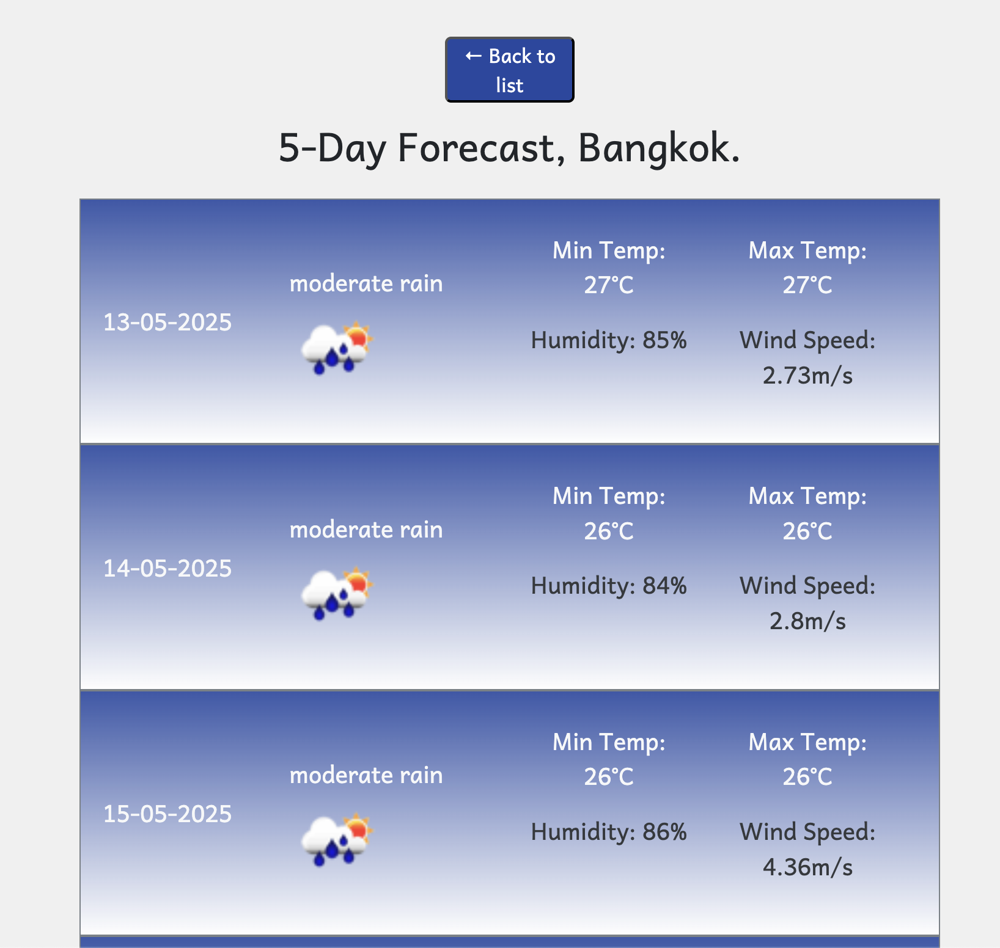

#  K-Weather App

## Project Description
K-Weather is a sleek, responsive weather forecast app that provides real-time weather updates and 5-day forecasts for cities around the world. Powered by the [OpenWeatherMap API](https://openweathermap.org/api), K-Weather is built with React and offers a fast and clean user experience.

##  Features

- 🔍 Search for any city worldwide
- 🌡️ View current temperature, weather description, highs & lows
- 📆 View 5-day forecast with daily details
- 📍 Save searched cities to localStorage
- ⚡ Lightning-fast and mobile responsive
- 💾 Data persistence using browser storage

---

## 🛠️ Technologies Used

- **React** – Front-end UI library
- **Bootstrap** – Responsive design and layout
- **OpenWeatherMap API** – Weather data provider
- **localStorage** – Persistent data saving

---

##  Screenshots
Search Results:

Forecast:

Current Weather:

---

##  Usage
- Type in the name of a city in the search bar and click "search" to view result.

- Click on result to display the city, including its current weather information on the page.

- To view the forecast, click anywhere on the current weather tile.

## Live Application
Click [here](https://anayoifediora.github.io/k-weather/) to view the application.

###  Prerequisites

- Node.js & npm installed
- An API key from [OpenWeatherMap](https://openweathermap.org/api)

